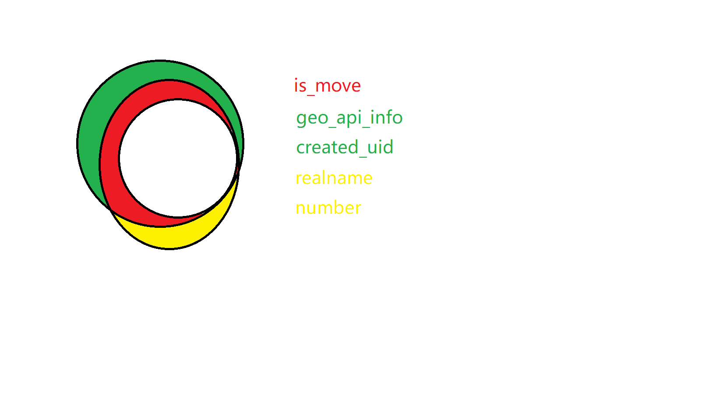

# buaa-ncov

## Run

```shell
pnpm i
node daily_clock.js -u *** -p ***
```

## Form fields



其中info=白, oldInfo=白+红+绿, form=白+红+黄

```xml
<?xml version="1.0" encoding="UTF-8"?>
<xml>
	<sfzs zh="是否住宿" type="radio-2" expand="2">
		<bzxyy zh="不在校原因" type="radio-6" expand="6">
			<bzxyy_other zh="不在校原因：其他" type="text"></bzxyy_other>
		</bzxyy>
	</sfzs>
	<brsfzc zh="本日是否正常" type="radio-2" expand="2">
		<tw zh="体温" type="radio-6"></tw>
		<sfcxzz zh="是否出现症状" type="radio-2" expand="1">
			<zdjg zh="诊断结果" type="radio-3" expand="3">
				<zdjg_other zh="诊断结果：其他" type="text"></zdjg_other>
			</zdjg>
		</sfcxzz>
		<sfgl zh="是否隔离" type="radio-2" expand="1">
			<gldd zh="隔离地点" type="radio-6" expand="6">
				<gldd_other zh="隔离地点：其他" type="text"></gldd_other>
			</gldd>
			<glyy zh="隔离原因" type="radio-3" expand="3">
				<glyy_other zh="隔离原因：其他" type="text"></glyy_other>
			</glyy>
			<gl_start zh="隔离开始时间" type="text"></gl_start>
			<gl_end zh="隔离结束时间" type="text"></gl_end>
			<sfmqjc zh="是否密切接触" type="radio-3"></sfmqjc>
		</sfgl>
	</brsfzc>
	<sfzc_14 zh="是否正常7日" type="radio-2" expand="2">
		<sfqw_14 zh="前往" type="radio-2" expand="1">
			<sfqw_14_remark zh="原因地点" type="text"></sfqw_14_remark>
		</sfqw_14>
		<sfzgfx zh="中高风险" type="radio-2" expand="1">
			<sfzgfx_remark zh="原因地点" type="text"></sfzgfx_remark>
		</sfzgfx>
		<sfjc_14 zh="接触" type="radio-2" expand="1">
			<sfjc_14_remark zh="原因地点" type="text"></sfjc_14_remark>
		</sfjc_14>
		<sfjcqz_14 zh="接触确诊" type="radio-2" expand="1">
			<sfjcqz_14_remark zh="原因地点" type="text"></sfjcqz_14_remark>
		</sfjcqz_14>
		<sfgtjz_14 zh="共同居住" type="radio-2" expand="1">
			<sfgtjz_14_remark zh="原因地点" type="text"></sfgtjz_14_remark>
		</sfgtjz_14>
		<szsqqz zh="所在社区确诊" type="radio-2"></szsqqz>
		<sfyqk zh="有情况" type="text" optional="true"></sfyqk>
	</sfzc_14>
	<szdd zh="所在地点" type="radio-2" expand="1,2,change">
		<area zh="所在地址：国内" type="text" expand="">
			<province zh="省" type="text"></province>
			<city zh="市" type="text"></city>
			<address zh="位置" type="text" hide="true"></address>
		</area>
		<gwdz zh="所在地址：国外" type="text"></gwdz>
		<is_move zh="不在同一城市" type="bool"></is_move>
		<move_reason zh="不在同一城市原因" type="radio-4" expand="4">
			<move_remark zh="不在同一城市原因：其他" type="text"></move_remark>
		</move_reason>
	</szdd>
	<realname zh="姓名" type="text" hide="true"></realname>
	<number zh="学号" type="text" hide="true"></number>
	<uid zh="用户ID" type="text" hide="true"></uid>
	<created zh="创建时刻" type="text" hide="true"></created>
	<date zh="提交日期" type="text" hide="true"></date>
	<id zh="打卡编号" type="text" hide="true"></id>
</xml>
```

## Acknowledgement

[SAGIRI-kawaii/buaa-covid-19-report](https://github.com/SAGIRI-kawaii/buaa-covid-19-report)

[SnapdragonLee/BUAA_AutoCheck](https://github.com/SnapdragonLee/BUAA_AutoCheck)